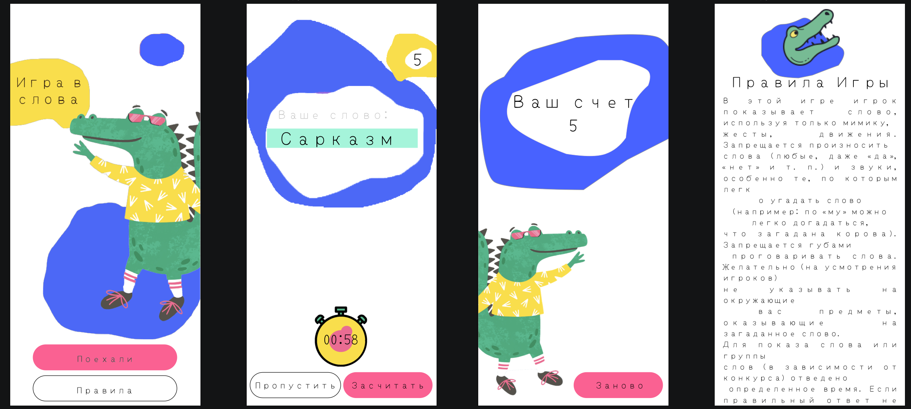

# Charades
Crocodile is a famous game in which you need to explain words with gestures. 
Play Crocodile at parties and on the road, with friends and children - and you are guaranteed a good mood!

## What I learned
- Navigation components
- Activity and Fragment Lifecycle
- Lifecycle Library
- Aplication Architecture

## Screenshot

